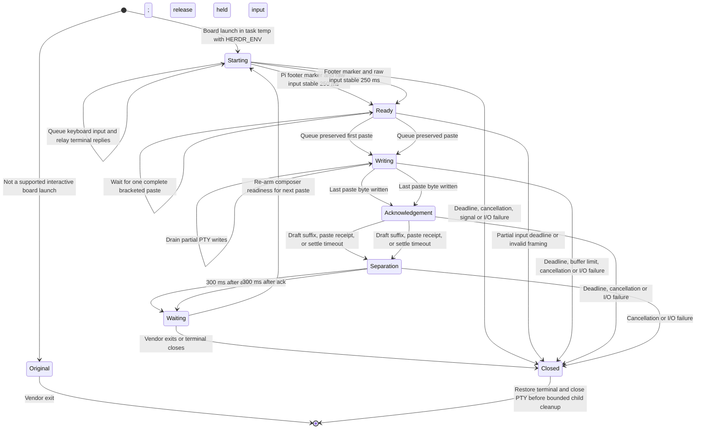

# Pi input lifecycle

```mermaid
stateDiagram-v2
    [*] --> Original: Not a supported interactive board launch
    Original --> [*]: Vendor exit
    [*] --> Starting: Board launch in task temp with HERDR_ENV
    Starting --> Starting: Queue keyboard input and relay terminal replies
    Starting --> Ready: Pi footer marker and raw input stable 250 ms
    Ready --> Ready: Wait for one complete bracketed paste
    Ready --> Writing: Queue preserved first paste
    Writing --> Writing: Drain partial PTY writes
    Writing --> Acknowledgement: Last paste byte written
    Acknowledgement --> Separation: Draft suffix, paste receipt, or settle timeout
    Separation --> Waiting: 300 ms after ack; release held input
    Waiting --> Starting: Re-arm composer readiness for next paste
    Starting --> Ready: Footer marker and raw input stable 250 ms
    Ready --> Ready: Wait for one complete bracketed paste
    Ready --> Writing: Queue preserved paste
    Writing --> Writing: Drain partial PTY writes
    Writing --> Acknowledgement: Last paste byte written
    Acknowledgement --> Separation: Draft suffix, paste receipt, or settle timeout
    Separation --> Waiting: 300 ms after ack; release held input
    Waiting --> Closed: Vendor exits or terminal closes
    Starting --> Closed: Deadline, cancellation, signal or I/O failure
    Ready --> Closed: Partial input deadline or invalid framing
    Writing --> Closed: Deadline, buffer limit, cancellation or I/O failure
    Acknowledgement --> Closed: Deadline, cancellation or I/O failure
    Separation --> Closed: Cancellation or I/O failure
    Closed --> [*]: Restore terminal and close PTY before bounded child cleanup
```

Readiness markers are assumptions about Pi's TUI output. Run the live
board smoke flow in [pi-input-gate.md](../pi-input-gate.md) when
changing markers or launch arguments.
